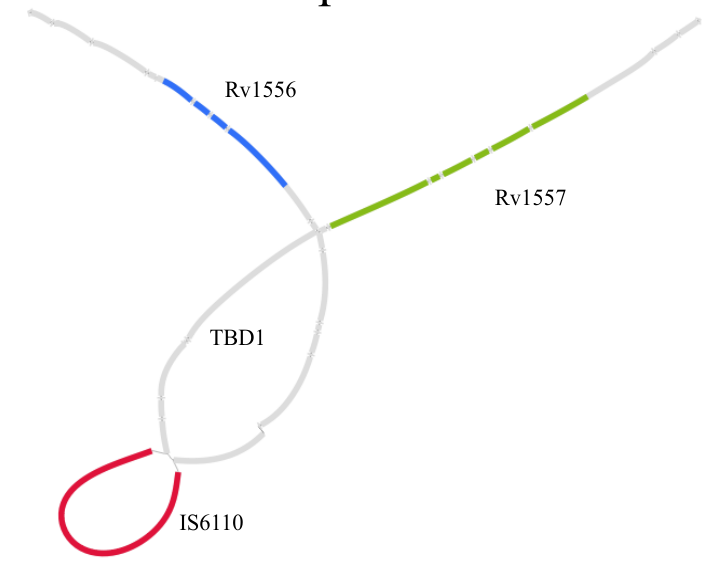

# Genome assembly and variant calling from PacBio HiFi reads

This folder contains two Snakemake workflows:
  - *assembly*: from PacBio HiFi consensus reads to annotated genome assemblies
  - *variantcalling*: combine assemblies into a pangenome graph and call variants from the graph

This is ongoing work, some things will change.

## Requirements
Running the workflows requires [Snakemake](https://snakemake.readthedocs.io) and [Singularity](https://docs.sylabs.io/guides/latest/user-guide/). Both are installed on sciCORE and can be loaded as modules: 

```
ml snakemake/6.6.1-foss-2021a 
ml Singularity/2.6.1
```

Enter subdirectories for further information.

#
*Section of a genome graph constructed from diverse MTBC genomes. It shows a nested structural variant: an IS6110 insertion within the TBD1 region.*
